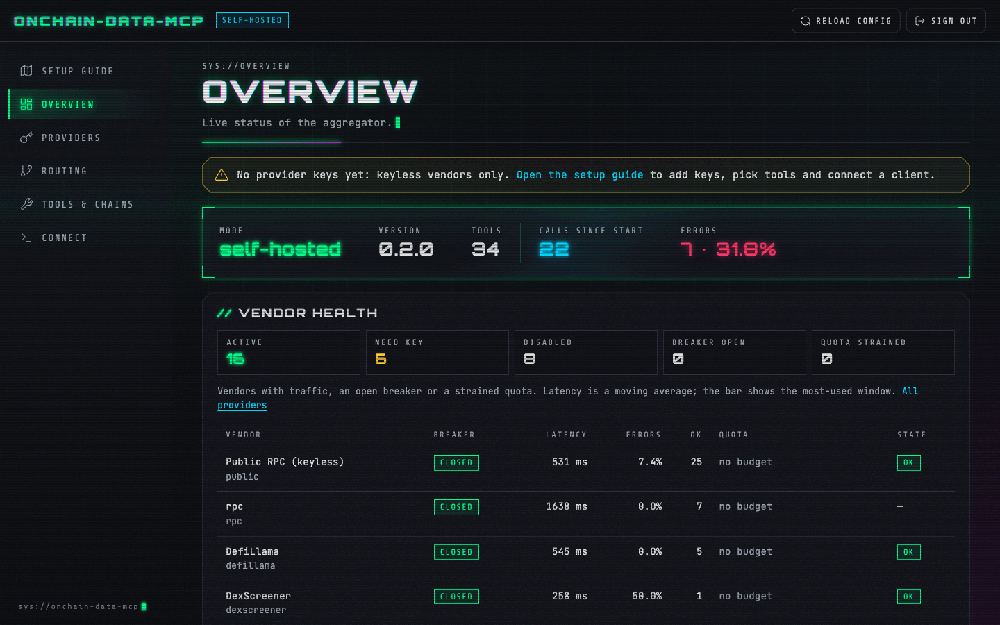
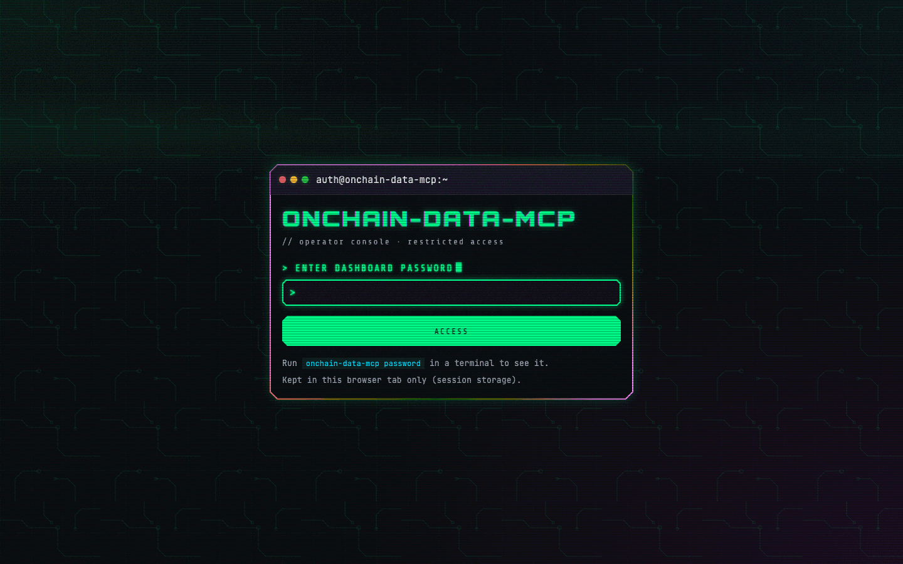
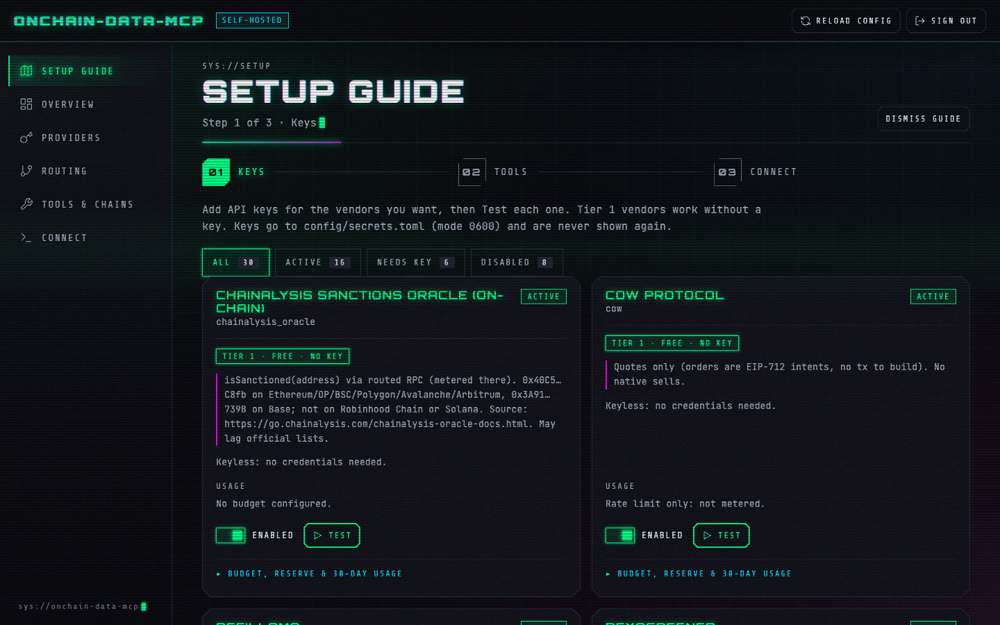
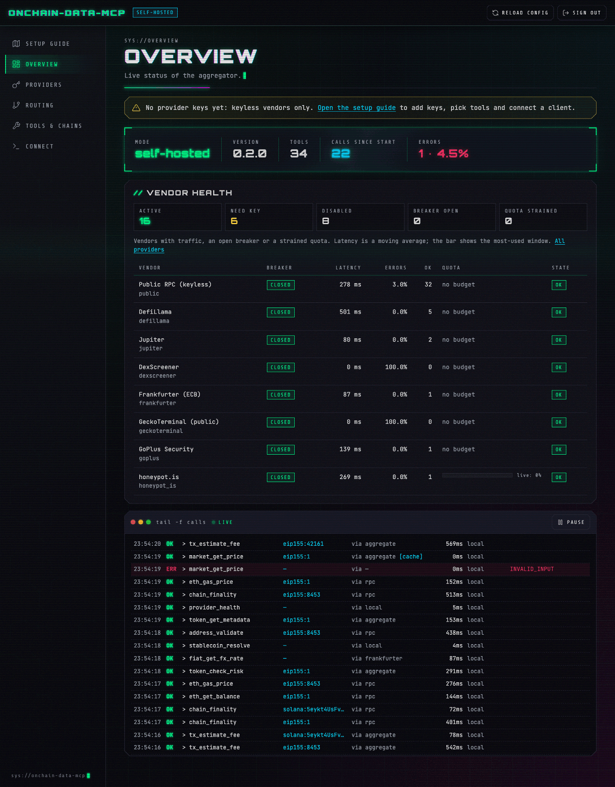
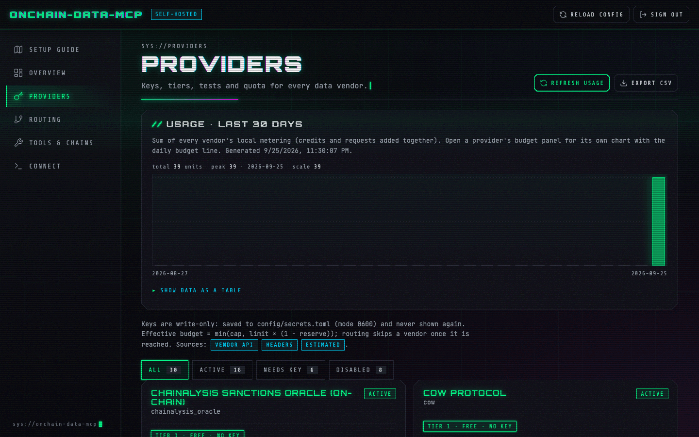
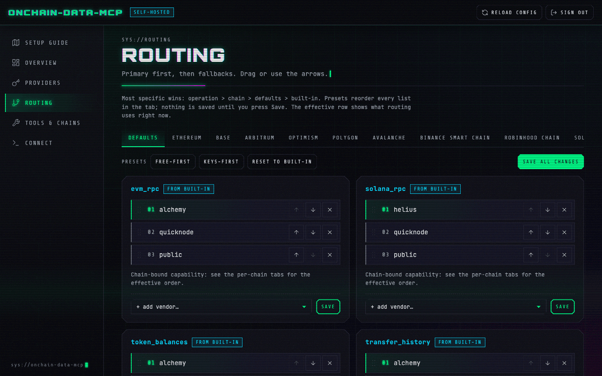
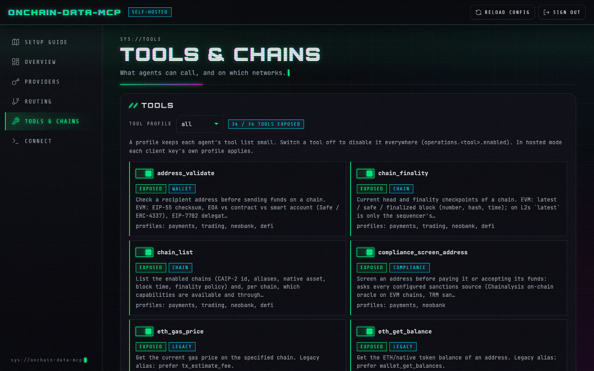
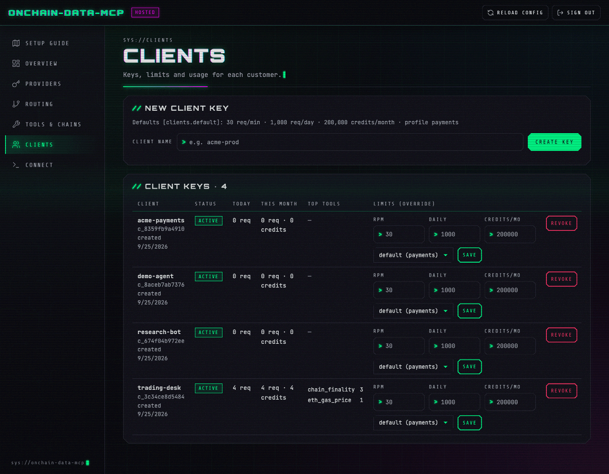
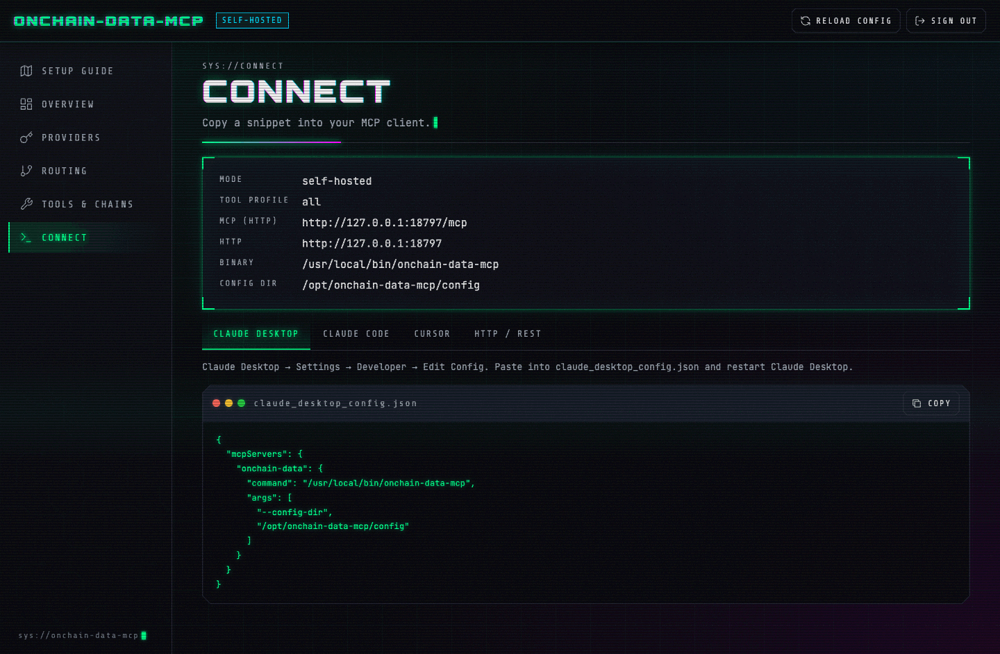

# onchain-data-mcp

**Give your AI assistant live blockchain data: wallet balances, payments, prices, scam checks and more. Free to start, no sign-ups needed.**

[](https://github.com/madlabs-tech/onchain-data-mcp/actions/workflows/ci.yml)
[](https://github.com/madlabs-tech/onchain-data-mcp/releases/latest)
[](LICENSE)

[](https://github.com/madlabs-tech/onchain-data-mcp/releases/latest/download/onchain-data-mcp.mcpb)
[](https://cursor.com/en/install-mcp?name=onchain-data&config=eyJjb21tYW5kIjoib25jaGFpbi1kYXRhLW1jcCJ9)
[](https://insiders.vscode.dev/redirect/mcp/install?name=onchain-data&config=%7B%22command%22%3A%22onchain-data-mcp%22%7D)

> The Claude Desktop button downloads a file you double-click; it has everything inside.
> The Cursor and VS Code buttons only add the settings, so [install the program](#1-install-the-program) first.

onchain-data-mcp is one small program that lets AI apps like Claude, Cursor and VS Code read the
blockchain. It works with **Ethereum, Base, Arbitrum, Optimism, Polygon, Avalanche, BNB Chain,
Robinhood Chain and Solana**.

Behind the scenes it asks about 30 data services ("providers") for you. If one is slow, busy or
down, it quietly asks the next one. Free services come first, so you can start without paying
anything and without any sign-ups.

A few words you will see here:

- **MCP** is a standard way for AI apps like Claude to use outside tools. This program is an "MCP server": a tool your AI app can use.
- **API key** is a free password a data provider gives you when you sign up. You don't need any to start. Adding a couple makes answers faster and more complete.
- **Wallet address** is the public "account number" of a crypto wallet, like `0xd8dA…6045` or `7xKX…9sHc`.



## Contents

- [What you can do](#what-you-can-do)
- [Quick start](#quick-start)
- [Connect to AI apps](#connect-to-ai-apps)
- [The dashboard](#the-dashboard)
- [Password and keys](#password-and-keys)
- [Data providers](#data-providers)
- [Available tools](#available-tools)
- [Real-world examples](#real-world-examples)
- [Running it for others](#running-it-for-others)
- [Troubleshooting](#troubleshooting)
- [FAQ](#faq)
- [For developers](#for-developers) · [Security](#security) · [License](#license)

## What you can do

Ask your AI assistant questions in plain words. It picks the right tool and gets the answer.

- **Check wallets.** See what coins and tokens a wallet holds, on every chain at once.
  *"What does wallet 0xd8dA6BF26964aF9D7eEd9e03E53415D37aA96045 hold?"*
- **Confirm payments.** Check that a customer really paid the right amount of USDC to the right address.
  *"Did transaction 0xabc… on Base pay 25 USDC to my shop address?"*
- **Stay safe.** Check if a token is a scam, if an address is on a sanctions list, or if a stablecoin is losing its value.
  *"Is this token on Solana a honeypot?"* · *"Is USDT still worth one dollar?"*
- **Follow the money.** Get transaction details, fees, and a bank-style statement for a wallet.
  *"Show me last week's incoming payments to my wallet, with their dollar value."*
- **Prices and swaps.** Get token prices from several sources, past prices, and swap quotes.
  *"What's the best price to swap 1 ETH to USDC on Arbitrum right now?"*
- **Tokenized stocks.** Look up stock tokens on Robinhood Chain and their prices.
  *"What is the price of the Tesla stock token on Robinhood Chain?"*

It **only reads** data, with one exception: it can send a transaction **that you already signed
yourself** in your own wallet. It never holds your keys and can never move your money on its own.

## Quick start

Three steps, about five minutes.

### 1. Install the program

Pick one. You only need to do this once.

**Mac or Linux** (open the Terminal app and paste):

```bash
curl --proto '=https' --tlsv1.2 -LsSf https://github.com/madlabs-tech/onchain-data-mcp/releases/latest/download/onchain-data-mcp-installer.sh | sh
```

**Windows** (open PowerShell and paste):

```powershell
powershell -ExecutionPolicy Bypass -c "irm https://github.com/madlabs-tech/onchain-data-mcp/releases/latest/download/onchain-data-mcp-installer.ps1 | iex"
```

**Homebrew** (Mac or Linux):

```bash
brew install madlabs-tech/tap/onchain-data-mcp
```

**Claude Desktop only, no Terminal needed** (Mac and Windows): download
[onchain-data-mcp.mcpb](https://github.com/madlabs-tech/onchain-data-mcp/releases/latest/download/onchain-data-mcp.mcpb)
and double-click it. Claude Desktop asks for an optional dashboard password and optional
provider keys. You can leave them all empty. Then skip to step 3.

<details>
<summary>Other ways: Docker, or build it yourself</summary>

**Docker**, for AI apps (Docker is a tool that runs programs in a sealed box):

```bash
docker run -i --rm -v onchain-data-mcp-data:/data ghcr.io/madlabs-tech/onchain-data-mcp:latest --config-dir /config
```

**Docker**, running in the background with the dashboard at `http://127.0.0.1:8787/dashboard`:

```bash
docker run -d --name onchain-data-mcp -p 127.0.0.1:8787:8787 -v onchain-data-mcp-data:/data -v onchain-data-mcp-config:/config ghcr.io/madlabs-tech/onchain-data-mcp:latest
docker exec onchain-data-mcp onchain-data-mcp password --config-dir /config
```

**Build it yourself** (needs [Rust](https://rustup.rs) 1.90 or newer):

```bash
cargo build --release -p onchain-data-mcp
# the program is now at target/release/onchain-data-mcp
```

</details>

When it's done, **open a new Terminal window** and check it works:

```bash
onchain-data-mcp --version
```

The installers put the program in a folder called `.cargo/bin` inside your home folder
(for example `/Users/you/.cargo/bin/onchain-data-mcp`, or `C:\Users\you\.cargo\bin\onchain-data-mcp.exe` on Windows).

### 2. Connect your AI app

Follow the steps for your app in [Connect to AI apps](#connect-to-ai-apps) below. Then restart
the app and ask it something, like *"Which chains can you read?"*

### 3. Open the dashboard

The dashboard is a control panel in your web browser. While your AI app is open, it runs at
`http://127.0.0.1:8787/dashboard`. It is protected by a password that was made for you.
To see it, run this in the Terminal (use the same folder you used in step 2):

```bash
onchain-data-mcp password --config-dir ~/.onchain-data-mcp
```

You'll see something like:

```text
Dashboard: http://127.0.0.1:8787/dashboard
Password:  f8460762fe006afc…
One-click login: http://127.0.0.1:8787/dashboard#login=f8460762fe006afc…
Config folder: /Users/you/.onchain-data-mcp
Source: /Users/you/.onchain-data-mcp/dashboard_password
```

Open the **one-click login** link and you're in. The **Setup guide** walks you through the rest:
add keys, pick tools, connect.

> If you used the Claude Desktop bundle, your folder is `~/.onchain-data-mcp` unless you picked another one.

## Connect to AI apps

**Pick one folder for your settings** and use it everywhere. We use `~/.onchain-data-mcp` here
(a folder called `.onchain-data-mcp` in your home folder). Replace `you` with your user name.

Why the full path? Some apps start programs from a different place, so short paths like `config`
end up in the wrong folder. A full path always works.

### Claude Desktop

1. Open Claude Desktop, go to **Settings → Developer → Edit Config**. This opens `claude_desktop_config.json`:
   - Mac: `~/Library/Application Support/Claude/claude_desktop_config.json`
   - Windows: `%APPDATA%\Claude\claude_desktop_config.json`
2. Paste this in (keep any other servers you already have inside `"mcpServers"`):

   ```json
   {
     "mcpServers": {
       "onchain-data": {
         "command": "/Users/you/.cargo/bin/onchain-data-mcp",
         "args": ["--config-dir", "/Users/you/.onchain-data-mcp"],
         "env": {
           "ODM__SERVER__DATA_DIR": "/Users/you/.onchain-data-mcp/data",
           "ALCHEMY_API_KEY": "",
           "HELIUS_API_KEY": ""
         }
       }
     }
   }
   ```

   - `command` is where the program is. Find yours with `which onchain-data-mcp` (Mac/Linux) or `where onchain-data-mcp` (Windows). Homebrew puts it in `/opt/homebrew/bin/onchain-data-mcp`.
   - On Windows, use paths like `"C:\\Users\\you\\.cargo\\bin\\onchain-data-mcp.exe"` (double backslashes).
   - The keys are optional. Leave them empty, remove them, or add them later in the dashboard.
3. Quit Claude Desktop completely and open it again.

### Claude Code

```bash
claude mcp add onchain-data -e ODM__SERVER__DATA_DIR=$HOME/.onchain-data-mcp/data -- onchain-data-mcp --config-dir $HOME/.onchain-data-mcp
```

### Cursor

Click the **Install in Cursor** button at the top, or paste this into `~/.cursor/mcp.json`
(or `.cursor/mcp.json` inside one project), then turn it on in **Cursor Settings → MCP**:

```json
{
  "mcpServers": {
    "onchain-data": {
      "command": "/Users/you/.cargo/bin/onchain-data-mcp",
      "args": ["--config-dir", "/Users/you/.onchain-data-mcp"],
      "env": { "ODM__SERVER__DATA_DIR": "/Users/you/.onchain-data-mcp/data" }
    }
  }
}
```

### VS Code

Click the **Install in VS Code** button at the top. To use your settings folder, open the MCP
settings in VS Code and add `"args": ["--config-dir", "/Users/you/.onchain-data-mcp"]`.

### Other apps (over the web address)

If the program is already running (for example started by another app, or with
`onchain-data-mcp serve`), any app that supports MCP over HTTP can connect to:

```text
http://127.0.0.1:8787/mcp
```

The dashboard's **Connect** page shows ready-to-copy settings with your real paths filled in.

## The dashboard

Your control panel at `http://127.0.0.1:8787/dashboard`. Only your own computer can open it.

| | |
|---|---|
|  | **Login.** Enter your dashboard password, or use the one-click link from `onchain-data-mcp password`. |
|  | **Setup guide.** Three steps: add keys, pick tools, connect your AI app. |
|  | **Overview.** Is everything healthy? Plus a live list of calls as they happen (counted since the last start). |
|  | **Providers.** Each data service with its tier, your key, a **Test** button, usage, budget and a 30-day chart. Export usage as a spreadsheet (CSV). |
|  | **Routing.** Which provider is asked first for each job. Drag to reorder, or use the up/down arrows. |
|  | **Tools & Chains.** Turn tools and chains on or off. |
|  | **Clients.** Only when you run it for others: create and cancel client keys, and set limits. |
|  | **Connect.** Copy-paste settings for Claude Desktop, Claude Code, Cursor and other apps. |

## Password and keys

There are three kinds of keys. Only the first one is needed, and it is made for you.

| Key | What it is | Who uses it |
|---|---|---|
| **Dashboard password** | The password for your control panel. | Only you. |
| **Client keys** (start with `odm_`) | Only when you [run it for others](#running-it-for-others). One per customer or app. Shown once when created. | Your customers' apps. |
| **Provider keys** | Your own free accounts at Alchemy, Helius and others. The program uses them on your behalf. | The program. Once saved, the dashboard never shows them again. |

**See your dashboard password** at any time:

```bash
onchain-data-mcp password --config-dir ~/.onchain-data-mcp
```

The program also prints the dashboard address every time it starts, but never the password.
It is saved in the file `dashboard_password` inside your settings folder.

> The one-click link contains your password, so it stays in your Terminal history.
> That's fine on your own computer; just don't paste it into chats or screenshots.

**Choose your own password**: set `DASHBOARD_PASSWORD` to at least 12 characters, with no spaces.
For Claude Desktop, add it to the `"env"` block, for example `"DASHBOARD_PASSWORD": "my-long-secret-2026"`.

**Make a new random password**:

```bash
onchain-data-mcp password reset --config-dir ~/.onchain-data-mcp
```

Then restart your AI app (or the program) so it uses the new password.

**Add provider keys**: in the dashboard go to **Providers**, paste the key and click **Test**.
Or add it to the `"env"` block of your AI app's settings, like `"ALCHEMY_API_KEY": "your-key"`.

## Data providers

Providers are sorted into four tiers:

| Tier | What it means | Examples |
|---|---|---|
| **1** | Free, no sign-up. Works right away. | DefiLlama, DexScreener, CoW Protocol, Frankfurter, public blockchain connections, RugCheck (18 in total) |
| **2** | Free key, big limit. | Alchemy, Helius |
| **3** | Free key, small limit. | 1inch, Birdeye, CoinGecko, Open Exchange Rates |
| **4** | Paid, trial only, or needs a sign-up key. Off unless you turn it on. | QuickNode, Moralis, Pyth, Ankr, 0x, Uniswap API, OKX DEX (7 in total) |

**Our advice:** start with no keys. When you want better results, get free keys from
[Alchemy](https://dashboard.alchemy.com/signup) and [Helius](https://dashboard.helius.dev/signup)
and paste them into the dashboard.

The full list, with limits and sign-up links, is in **[docs/VENDORS.md](docs/VENDORS.md)**.

## Available tools

These are the tools your AI app can use. You don't call them yourself; your AI assistant picks
them. "Profiles" are ready-made tool sets (`payments`, `trading`, `neobank`, `defi`). By default
you get all of them. You can pick a smaller set on the dashboard's **Tools & Chains** page.

Every tool only reads data, **except `tx_broadcast`**, which sends a transaction you already signed.

### Chains and health

| Tool | What it does | Profiles |
|---|---|---|
| `chain_list` | Lists the supported chains and which features work on each | all |
| `chain_finality` | Shows the latest block and whether it is final (can no longer change) | all |
| `provider_health` | Shows which data providers are working, and why one was skipped | all |

### Wallets

| Tool | What it does | Profiles |
|---|---|---|
| `wallet_get_balances` | Coins and tokens in a wallet, across all chains | all |
| `wallet_get_transfers` | Money in and out of a wallet, newest first | payments, neobank, trading |
| `address_validate` | Checks an address before you send money to it | all |

### Transactions

| Tool | What it does | Profiles |
|---|---|---|
| `tx_get` | Full details of one transaction | all |
| `tx_status` | Quick check: pending, done or failed | all |
| `tx_estimate_fee` | Current network fees (slow, normal, fast), also in dollars | all |
| `tx_simulate` | Test-runs a transaction without sending it | all |
| `tx_build_transfer` | Prepares a transfer for **you** to sign in your own wallet | payments, neobank, trading |
| `tx_broadcast` | Sends a transaction **you already signed**. The only tool that changes anything | all |

### Payments

| Tool | What it does | Profiles |
|---|---|---|
| `payments_verify_transfer` | Confirms a payment arrived: right coin, right amount, right address | payments, neobank |
| `payments_list_deposits` | Lists incoming stablecoin payments to your addresses | payments, neobank |
| `payments_build_request` | Makes a payment request link or QR code content | payments, neobank |

### Stablecoins

Stablecoins are crypto coins meant to stay worth one dollar (or euro), like USDC and USDT.

| Tool | What it does | Profiles |
|---|---|---|
| `stablecoin_resolve` | Finds the real, official contract of a stablecoin and flags fakes | payments, neobank |
| `stablecoin_check_restrictions` | Checks if the issuer froze or blocked an address | payments, neobank |
| `stablecoin_peg` | Checks if a stablecoin is still worth one dollar (or euro) | payments, neobank, trading |

### Compliance

| Tool | What it does | Profiles |
|---|---|---|
| `compliance_screen_address` | Checks an address against sanctions lists before you pay or accept money | payments, neobank |

### Money (fiat and banking)

| Tool | What it does | Profiles |
|---|---|---|
| `fiat_get_fx_rate` | Exchange rate between two currencies, like USD to EUR, today or on a date | neobank, payments |
| `neobank_get_ledger` | Bank-style statement for a wallet, with the dollar value at the time | neobank |
| `neobank_card_funding_status` | Explains if a crypto card can be paid from a wallet, and why a payment was declined | neobank |

### Market and tokens

| Tool | What it does | Profiles |
|---|---|---|
| `market_get_price` | Current token price, checked against several sources | trading, defi, neobank |
| `market_get_price_at` | Token price at a past date and time | trading, defi, neobank |
| `token_get_metadata` | Token name, symbol, logo and how many decimal places it uses | all |
| `token_check_risk` | Scam check before you buy a token (for example a "honeypot": a token you can buy but never sell) | trading |

### Trading

| Tool | What it does | Profiles |
|---|---|---|
| `trade_get_swap_quote` | Swap prices from several exchanges at once | trading |
| `trade_build_swap_tx` | Prepares a swap for **you** to sign in your own wallet | trading |

### Real-world assets

| Tool | What it does | Profiles |
|---|---|---|
| `rwa_token_info` | Facts about a tokenized stock, and whether it is the official one | trading |
| `rwa_price` | Price of a tokenized stock, aware of stock market hours | trading |

Older setups can still use four legacy tools: `eth_get_balance`, `eth_get_code`, `eth_gas_price`
and `eth_get_transaction_by_hash`. New setups should use the tools above.

## Real-world examples

Copy any of these into your AI app.

**Wallets**

- *"What tokens does 0xd8dA6BF26964aF9D7eEd9e03E53415D37aA96045 hold, on every chain?"*
- *"Is this address a normal wallet or a smart contract?"*

**Payments**

- *"Did transaction 0x… on Base pay at least 25 USDC to 0x…? Is it final?"*
- *"List new USDC deposits to my three shop addresses on Polygon since this morning."*
- *"Make a payment request for 10 USDC on Solana to my address."*

**Safety**

- *"Before I pay this address, check it against sanctions lists."*
- *"Is USDC on Arbitrum still worth one dollar?"*
- *"Is this new Solana token a scam?"*

**Money**

- *"What was the EUR to USD rate on 2026-03-15?"*
- *"Give me a statement of my wallet's transactions this month, with dollar values."*
- *"Why was my crypto card payment declined?"*

**Trading**

- *"Get me the best quote to swap 500 USDC to ETH on Base."*
- *"What was the price of SOL on 1 January 2026?"*
- *"How much is the network fee on Ethereum right now, in dollars?"*

**Tokenized stocks**

- *"Is this Robinhood Chain token the official NVIDIA stock token? What's its price?"*

## Running it for others

By default the program runs **just for you**, on your computer ("self-hosted").

You can also put it on a server and let other people or apps use it ("hosted"). Each customer
gets their own **client key**, with their own limits. You manage everything from the dashboard.

The step-by-step guide is in **[DEPLOYMENT.md](DEPLOYMENT.md)**.

## Troubleshooting

**"missing or invalid dashboard password"**

1. Run `onchain-data-mcp password --config-dir <your folder>` and use that password.
2. Use the **same folder** your AI app uses. A different folder has a different password.
3. If you changed the password, restart your AI app so it picks up the change.

**"DASHBOARD_PASSWORD is too short" or "DASHBOARD_PASSWORD can only use plain letters…"**

Your own password must be at least 12 characters, with no spaces or accented letters.
Fix it, or remove `DASHBOARD_PASSWORD` to use a generated one. Until then the dashboard
stays off (the rest keeps working), and you'll see "dashboard turned off" in the logs.

**"The password comes from the DASHBOARD_PASSWORD setting. Change it there instead."**

You set your own password, so `password reset` can't replace it. Change `DASHBOARD_PASSWORD` instead.

**"HTTP not started (Address already in use); stdio only"** or the dashboard page won't load

Something else is already using port 8787 (a "port" is like a door number on your computer).
Often it's a second copy of this program, for example two AI apps running it at once.
Your AI app still works; only the dashboard is missing. Close the other copy, or open the
dashboard of the copy that is running.

**The AI app doesn't show the tools, or says the server failed to start**

1. Check the `command` path. Run `which onchain-data-mcp` (Mac/Linux) or `where onchain-data-mcp` (Windows) and paste that full path.
2. Check the settings text (JSON) has no missing commas or quotes.
3. Quit the app completely and open it again.
4. Claude Desktop logs: Mac `~/Library/Logs/Claude/`, Windows `%APPDATA%\Claude\logs\`.

**Mac says "onchain-data-mcp cannot be opened" or "developer cannot be verified"**

This only happens if you downloaded the file by hand. Run this once in the folder with the file:

```bash
xattr -d com.apple.quarantine onchain-data-mcp
```

**Linux: "GLIBC_2.35 not found"**

Your Linux is older than the ready-made program supports. Use the Docker option instead.

**"hosted mode requires at least one client key"** or **"hosted mode requires public_bind"**

These only appear when running it for others. See [DEPLOYMENT.md](DEPLOYMENT.md).

**A tool says it's not supported on a chain**

That feature needs a provider key you haven't added yet. Ask *"Which chains and features can you use?"*
(the `chain_list` tool) to see what's missing, then add the key on the **Providers** page.

## FAQ

**Is it free?**
Yes. The program is free and open source (MIT license). It uses free data services first.
Some providers have paid plans, but you never need them.

**Do I need any keys?**
No. It works right away with the free, no-sign-up providers. Free Alchemy and Helius keys make
it faster and more complete.

**Which chains does it support?**
Ethereum, Base, Arbitrum, Optimism, Polygon, Avalanche, BNB Chain, Robinhood Chain and Solana.

**Can it move my money?**
No. It never has your wallet's secret keys. It can prepare a transaction for you to sign in your
own wallet, and `tx_broadcast` can send one **you already signed**. It can't sign anything itself.

**Is my data safe? Where do my keys go?**
Everything stays on your computer. Your provider keys are saved in `secrets.toml` in your settings
folder (only your user can read it on Mac and Linux) and are sent only to that provider.
The dashboard only accepts connections from your own computer.

**Where are my settings saved?**
In the folder you chose (for example `~/.onchain-data-mcp`): `config.toml` for settings,
`secrets.toml` for keys, `dashboard_password`, and a `data` folder with usage numbers.

**How do I update it?**
Run the install command again (or `brew upgrade onchain-data-mcp`), then restart your AI app.
For Claude Desktop, download and double-click the new `.mcpb` file.

## For developers

REST API, settings reference, routing, architecture, building, testing and releases:
**[docs/TECHNICAL.md](docs/TECHNICAL.md)**.

## Security

Found a security problem? Please report it privately, as explained in **[SECURITY.md](SECURITY.md)**.

## License

[MIT](LICENSE). The dashboard fonts are under the SIL Open Font License
([OFL.txt](crates/transport-http/src/dashboard/fonts/OFL.txt)).
